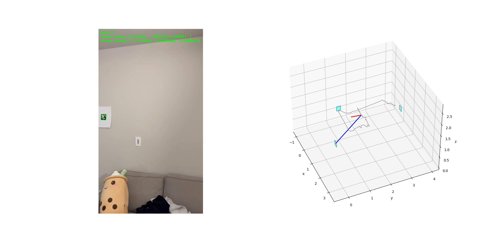

# [CEE247C] Camera Position Plotter with AprilTag Detection
This Python project detects AprilTag markers in a video, estimates the camera's position, and plots it in 3D.

### Requirements
Install dependencies with:

```
pip3 install -r requirements.txt
```

### Usage
Run the script with:

```
python3 main.py <video_path> [--skip_frame <n>]
```

- <video_path>: Path to the video file (required).
- --skip_frame: Number of frames to skip between updates (default: 1).

### Example
```
python3 main.py example/video.mp4 --skip_frame 3
```


